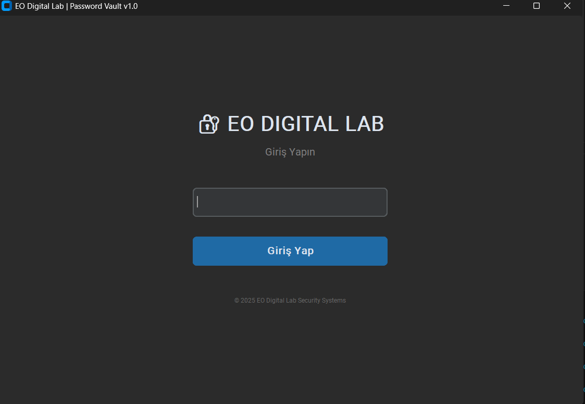

# 🛡️ EO Digital Vault | Professional Password Manager

   

**EO Digital Vault**, verilerinizi 3. parti bulut sunucularında değil, kendi bilgisayarınızda askeri standartlarda şifreleyerek saklayan, yerel (offline) ve modern bir parola yönetim aracıdır.

Bu proje **EO Digital Lab** siber güvenlik çalışmaları kapsamında geliştirilmiştir.



## 🚀 Proje Hakkında

Günümüzde veri güvenliği en kritik konudur. EO Digital Vault, şifrelerinizi bir metin dosyasında saklamak yerine, **kriptografik** yöntemlerle korunan güvenli bir veritabanında (Vault) saklar.

Uygulama **"Zero-Knowledge" (Sıfır Bilgi)** prensibiyle çalışır. Yani Ana Şifrenizi (Master Password) sizden başka kimse (geliştirici dahil) bilemez ve verilerinize erişemez.

## 🔐 Güvenlik Mimarisi (Technical Specs)

Bu proje basit bir arayüz çalışması değildir. Arka planda endüstri standardı güvenlik algoritmaları çalışır:

* **AES-128 (Fernet) Şifreleme:** Her bir parola veritabanına kaydedilmeden önce şifrelenir. Veritabanı dosyası çalınsa bile, Master Password olmadan veriler anlamsızdır.
* **PBKDF2-HMAC-SHA256:** Master Password'ünüz asla veritabanında saklanmaz. Bunun yerine, rastgele üretilen bir **Salt (Tuz)** değeri ile hashlenerek saklanır.
* **Secure Random Generation:** Şifre oluşturucu modülü, Python'un standart `random` kütüphanesini değil, kriptografik olarak güvenli `secrets` modülünü kullanır.

## ✨ Özellikler

* 🎨 **Modern Arayüz:** `CustomTkinter` ile geliştirilmiş şık Dark Mode tasarımı.
* 🎲 **Güçlü Şifre Üretici:** Tek tıkla kırılması zor şifreler oluşturun.
* 📋 **Akıllı Kopyalama:** Şifreleri görüntülemeden panoya kopyalama imkanı.
* 💾 **Yerel Veritabanı:** İnternet gerektirmez, verileriniz bilgisayarınızda kalır (`SQLite`).
* 🆔 **Marka Kimliği:** EO Digital Lab kurumsal güvenlik standartlarına uygun geliştirme.

## 🛠️ Kurulum (Installation)

Projeyi kendi bilgisayarınızda çalıştırmak için adımları izleyin:

1.  **Repoyu Klonlayın:**
    ```bash
    git clone [https://github.com/0Ersin0/secure-password-manager.git](https://github.com/0Ersin0/secure-password-manager.git)
    cd secure-password-manager
    ```

2.  **Gerekli Kütüphaneleri Yükleyin:**
    ```bash
    pip install -r requirements.txt
    ```

3.  **Uygulamayı Başlatın:**
    ```bash
    python main.py
    ```

## 📦 Gereksinimler

* Python 3.x
* customtkinter
* cryptography
* pyperclip

## ⚠️ Yasal Sorumluluk Reddi (Disclaimer)

Bu yazılım (**EO Digital Vault**), eğitim ve portföy geliştirme amaçlı hazırlanmış açık kaynaklı bir projedir.

1.  **Garanti Yoktur:** Yazılım "OLDUĞU GİBİ" (AS IS) sunulmaktadır. Herhangi bir garanti verilmemektedir.
2.  **Veri Kaybı:** Master Password'ün unutulması durumunda verilerin kurtarılması **imkansızdır**. Bu bir hata değil, güvenlik özelliğidir.
3.  **Kullanıcı Sorumluluğu:** Yazılımın kullanımı sonucu oluşabilecek veri kayıplarından veya güvenlik ihlallerinden geliştirici sorumlu tutulamaz. Kritik şifrelerinizin tek yedeği olarak kullanmanız önerilmez.

---

### 👨‍💻 Geliştirici

**Geliştirici:** [0Ersin0](https://github.com/0Ersin0)
**Marka:** EO Digital Lab Security Systems

Copyright © 2025 EO Digital Lab.
Distributed under the MIT License.